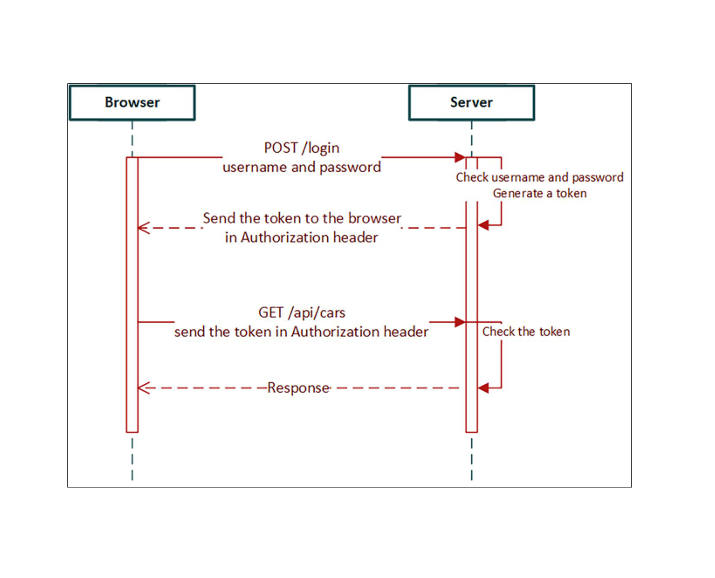

# 금일 수업내용

---

## 1. 복습 — 프론트엔드 CRUD (axios)

### axios 요청 메서드 정리

| 요청 | 메서드 | 필요한 것 |
|------|--------|----------|
| GET (전체) | `axios.get(url)` | URL만 |
| GET (개별) | `axios.get(url)` | URL + ID (고유값) |
| DELETE | `axios.delete(url)` | URL + ID |
| POST | `axios.post(url, data, config)` | URL + 객체 + 헤더 |
| PUT | `axios.put(url, data, config)` | URL + ID + 객체 + 헤더 |

### POST / PUT argument 상세

```ts
// POST
axios.post(
  'http://localhost:8080/api/vehicles',              // arg1: URL
  car,                                               // arg2: 추가할 데이터 객체
  { headers: { 'Content-Type': 'application/json' } } // arg3: 메타데이터
)

// PUT
axios.put(
  'http://localhost:8080/api/vehicles/1',            // arg1: URL + ID (수정 대상 고유값)
  car,                                               // arg2: 수정할 전체 데이터 객체
  { headers: { 'Content-Type': 'application/json' } } // arg3: 메타데이터
)
```

> PUT은 수정 대상의 **전체 필드**가 포함된 객체를 보내야 한다.  
> 일부 필드만 보내는 부분 수정은 PATCH 요청을 사용한다.

---

## 2. 현재 상황 — Spring Security 적용

백엔드 `SecurityConfig` 수정으로 `/login` POST 요청을 제외한  
**모든 엔드포인트에 인증이 필요**한 상태.

| 환경 | 인증 방법 |
|------|----------|
| 프론트엔드 서버 | 서버 실행 시 자동 처리 |
| Postman | `/login`으로 JWT 발급 후 Authorization 탭에 붙여넣기 |
| HeidiSQL | DB 최초 접속 시 username/password 인증 완료로 별도 처리 불필요 |

### Postman JWT 발급 순서

```
POST /login
  body: { username: "user", password: "user" }
         또는
         { username: "admin", password: "admin" }
  → JWT 발급
    → Authorization 탭에 복붙
      → 이후 요청 가능
```
# Frontend Protection

- /login 엔드포인트에 대해서 POST 요청을 보낼수 있는 frontend의 작성이 요구된다.

- 이후 모든 요청에 대해서 발급 받은 token(jwt)을 headers의 authorization 부분에 토큰을 담아서 진행하게 된다.

## Login 컴포넌트 생성
1. components 폴더에 login.tsx 생성하고 초기화
2. axios / useState import 하기
3. username과 password를 properties로 가지는 type User를 정의하기
4. user 상태를 선언하기
5. isAuthenticated 상태를 boolean 자료형으로 선언 후, false로 초기화.

```tsx
import axios from "axios";
import { useState } from "react";
import { Button, TextField, Stack } from "@mui/material";

type User = {
  username: string;
  password: string;
};

export default function Login() {

  const [user, setUser] = useState<User>({
    username: '',
    password: ''
  });

  const [isAuthenticated, setAuth] = useState(false);

  const handleChange = (event:React.ChangeEvent<HTMLInputElement>) => {
  setUser({...user,[event.target.name]: event.target.value});
  };

  return(

    <>
      <Stack spacing={2} alignItems='center' mt={2}>
        <TextField name="username" label='Username' onChange={handleChange}></TextField>
        <TextField name="password" label='Password' onChange={handleChange}></TextField>
        <Button
          variant="outlined"
          color="primary"
          onClick={handleLogin}
        >로그인</Button>
      </Stack>
    
    </>
  )
}
```

- 이상까지 5번까지의 지시사항을 바탕으로 TextField가 두개 필요하다는것을 알수있다. 그리고 버튼을 눌렀을때만 POST 요청이 가야하기 때문에 handleLogin이라는 함수가 필요하다는것도 알수있다.

- handleLogin()은 /login 엔드포인트에 대해 POST 요청을 날려야 하는데, 오늘 복습 부분에서 POST 요청에 대한 구조를 확인하면 `() => {}` 구조라는 의미이다. axios.post() 요청의 경우 arguments 구조를 작성했고, endpoint도 알고 나머지도 이미 템플릿으로 되어있다.

- AddCar.tsx 확인하여 handleLogin을 동기적 / 비동기적 으로 작성

1. 동기적 작성
```tsx
const handleLogin = async () => {
    try {
      // 1. 요청 전송 및 응답 대기
        const response = await axios.post(`${import.meta.env.VITE_API_URL}/login`, user, {
      headers: {
        'Content-Type':'application/json',
      }
    });

    // 2. 응답 헤더에서 토큰 추출
    const jwtToken = response.headers.authorization;

    // 3. 토큰 존재 여부 확인 및 상태 업데이트
    if (jwtToken !== null && jwtToken !== undefined) {
      localStorage.setItem('jwt', jwtToken);  // 브라우저에 jwt 토큰 저장
      setAuth(true);  // 리엑트 상태에서 인증되었다고 바꿔줌.
    }
  } catch (err) {
    // 4. error 발생시 핸들링
    console.error('로그인 중 문제가 발생했습니다. : ', err);
  }


  };
```

2. 비동기적 작성
```tsx
const handleLogin = () => {
  // 탬플릿 리터럴 없이 작성
    axios.post(import.meta.env.VITE_API_URL + '/login', user, {
    headers: {
      'Content-Type': 'application/json'
    }
  })
  .then(res => {
    const jwtToken = res.headers.authorization;
    if(jwtToken !== null && jwtToken !== undefined) {
      localStorage.setItem('jwt',jwtToken);
      setAuth(true);
    }
  })
  .catch(err => {
    console.error('로그인 중 오류가 발생했습니다 ', err)
  })
  }
```

- 이상까지 작성했을때 localStorage에 jwt key가 생성되었고, Carlist 컴포넌트를 불러오려고 시도 했을때 실패한다면 의도한대로 구현이 된것이다. 그렇다면 왜 오류가 발생하는지 이유는 -> getCars()함수를 호출을 할때 token이 담겨있지않다는 것은 여전하기 때문이다. 그러면 getCars() 함수가 있는 ts를 수정해야한다. axios.get() 요청 할때 토큰을 담아야 한다. 그래서 복습 할때는 axios.get() 요청시 argment가 하나였지만 이제 두개로 늘어야 한다. url.token이 포함된 `{headers: {'Authorizaion': token}}`

- 토큰 미 포함시
```ts
export const getCars = async () : Promise<CarResponse[]> => {
    const response = await axios.get(`${import.meta.env.VITE_API_URL}/api/vehicles`);

    return response.data._embedded.cars;
  }
```

- 그러면 토큰을 가져와야 한다. 그런데 react는 props drilling을 통해서 단방향 으로만 data flow가 일어난다. 근데 얘는 애초에 함수만 분리해서 확장자가 ts이다.

- 수정 후

```ts
import { CarEntry, CarResponse } from '../types'
import { Car } from '../types';
import axios from 'axios'

// GET
export const getCars = async () : Promise<CarResponse[]> => {
    const token = localStorage.getItem('jwt');
    const response = await axios.get(`${import.meta.env.VITE_API_URL}/api/vehicles`,{
      headers: {
        'Authorization': token
      }
  });

    return response.data._embedded.cars;
  }

// DELETE
export const deleteCar = async(link: string) => {
  const token = localStorage.getItem('jwt');
  const response = await axios.delete(link, {
    headers: {
      'Authorization': token
    }
  });
  return response.data;
}

// POST
export const addCar = async (car: Car) => {
  const token = localStorage.getItem('jwt');
  const response = await axios.post(`${import.meta.env.VITE_API_URL}/api/vehicles`, car, {
    headers: {
      'Authorization': token
    }
  });
  return response.data;
}


// PUT
export const updateCar = async (carEntry: CarEntry): Promise<CarResponse> => {
  const token = localStorage.getItem('jwt');
  const response = await axios.put(carEntry.url, carEntry.car, {
    headers: {
      'Content-Type': 'application/json',
      'Authorization': token
    },
  });

  return response.data;
}

```

- 현재의 수업 내용에서 axios를 이용한 CRUD에서 token을 추가하여 authoraized 하는 방법을 작성했다. 그런데 token을 불러오는 지역변수가 많으니 동일한 부분이 반복되고 있다는것을 확인 할수있는데 코드 반복을 피하도록 템플릿을 생성한다.

```ts
import { CarEntry, CarResponse } from '../types'
import { Car } from '../types';
import axios from 'axios'
import { AxiosRequestConfig } from 'axios';

const getAxiosConfig = () : AxiosRequestConfig => {
  const token = localStorage.getItem('jwt');

  return {
    headers: {
      'Authorization' :token,
      'Content-Type' : 'application/json'
    }
  };
}
// GET
export const getCars = async () : Promise<CarResponse[]> => {
    const response = await axios.get(`${import.meta.env.VITE_API_URL}/api/vehicles`,getAxiosConfig());

    return response.data._embedded.cars;
  }

// DELETE
export const deleteCar = async(link: string) => {
  const response = await axios.delete(link, getAxiosConfig());
  return response.data;
}

// POST
export const addCar = async (car: Car) => {
  const response = await axios.post(`${import.meta.env.VITE_API_URL}/api/vehicles`, car, getAxiosConfig());
  return response.data;
}


// PUT
export const updateCar = async (carEntry: CarEntry): Promise<CarResponse> => {
  const response = await axios.patch(carEntry.url, carEntry.car, getAxiosConfig());

  return response.data;
}

```

- 이상은 AxiosRequestConfig 자료형을 도입하여 getAxiosConfig 함수를 정의하고 각 CRUD에 포함시켰다. 공통된 지역변수 부분을 바깥으로 빼내고, 함수의 호출을 통해 반복적인 코드를 줄이면서 유지보수성 및 코드 가독성을 향상 시켯다.

- AxiosRequestConfig : Axios 라이브러리에서 HTTP 요청을 만들때 사용되는 구성으로 return타입은 'JS 객체'에 해당한다. 즉, Axios를 경유하여 요청을 보내기 위해 필요한 모든 옵션(headers 뿐만 아니라 다른 메타데이터를 포함하여)을 담는 일종의 interface에 해당한다.

## 오류 메시지 표시하기
- 로그인 과정에서 authentication이 실패할 경우 Snackbar를 통해 토스트 메시지를 띄우도록 한다.
- Snackbar를 Import 해야하고, 모달처럼 요구하는 형태가 되어야한다.

## 로그아웃(Logout)
- 버튼을 클릭했을때, jwt를 삭제하도록 할 예정이다. `localStorage.setItem('jwt', ''), setAuth(false);`

- 처음 디폴트 엔드포인트로 들어가면 Login 컴포넌트가 나오는 상태이다. 거기서 authentication이 완료가 되면 Carlist 컴포넌트가 렌더링 된다. 그러면 로그아웃 버튼 자체는 Carlist에 있어야 하는데, 그렇다면 handleLogout 함수는 Login 컴포넌트에 있고, 그 함수를 Carlist로 props drilling 해줘야 한다.

- 현재 Login 컴포넌트를 지나면 Carlist로 들어가고, POST 요청이나 PUT 요청인 경우에 Dialog가 렌더링 되는 등 기본적으로 Carlist 내부에서 결판나는 상황이기 때문에 Carlist 컴포넌트 내부에 Logout 버튼이 존재한다. 하지만 여러 페이지로 구성된 복잡한 프론트엔드로 디자인했다면 AppBar 컴포넌트에 로그아웃 버튼을 렌더링하여 각 페이지마다 표시되게 하는게 좋다. 거기서 끝이 아니라 AppBar에서 하위 컴포넌트들로 연속적으로 props drilling을 해야하는데, 현재 구조를 보면 그것도 불가능 하다는 것을 알수있다. 그땐 전역관리 -> ContextAPI 혹은 Zustand를 사용해야 한다.

- 게시물에 좋아요 개수를 추적했는데 마이페이지에서 내가 받은 좋아요 개수 총 합 같은걸 집어넣었을땐 like 상태 역시 전역적으로 관리되어야 한다.

### OAuth2 설정 Back_Front 프로젝트
korit_12_oauth2 폴더 생성

## Backend 프로젝트 생성
